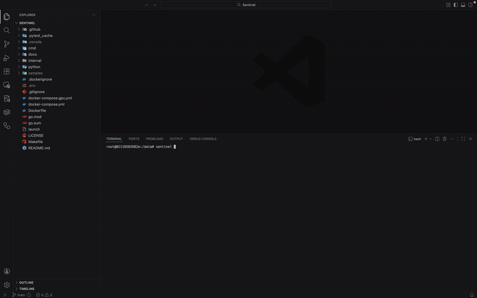

# Sentinel: Biometric Video Indexing and Redaction

[](https://github.com/andresmejia3/sentinel/actions)
[](https://goreportcard.com/report/github.com/andresmejia3/sentinel)
[](https://go.dev/)
[](https://www.python.org/)
[](https://www.docker.com/)
[](LICENSE)

Sentinel is a high-performance biometric video indexing and redaction engine built with a hybrid Go + Python architecture. It scans video, extracts face embeddings with InsightFace, stores them in PostgreSQL with `pgvector`, and supports human-reviewed identity indexing, similarity search, and targeted redaction.

Under the hood, Sentinel is designed like a real systems project: Go orchestrates concurrency, worker lifecycles, FFmpeg streaming, and database coordination, while persistent Python workers handle ML inference over a custom binary IPC pipeline. The result is a zero-disk frame-processing workflow built for long-form video, human-in-the-loop accuracy, and production-style data integrity.

## Contents

- [Highlights](#highlights)
- [Redaction Demo](#redaction-demo)
- [Default Workflow](#default-workflow)
- [Architecture](#architecture)
- [Command Reference](#command-reference)
- [Installation and Usage](#installation-and-usage)
- [Roadmap](#roadmap)

## Highlights
- Hybrid Go + Python Architecture: Uses Go for concurrency, orchestration, cancellation, and database coordination, while Python stays focused on InsightFace inference.
- Zero-Disk Video Pipeline: Streams frames from FFmpeg through Go into warm Python workers without writing temporary frame images to disk.
- Warm Worker Pool + Binary IPC: Keeps inference workers alive and communicates over a custom binary protocol so the system avoids per-frame Python startup and model warmup overhead.
- Iterative Same-Video Identity Refinement: Sentinel does not greedily cluster split tracks once and stop. It stages regrouping decisions against frozen snapshots, reruns refinement rounds until stable, blocks impossible time-overlap merges, and leaves borderline cases unresolved for human review.
- Distance-Aware Review Suggestions: Sentinel pre-fills `merge`, `new_variant`, `new_identity`, or `needs review` by comparing the strongest nearby identity matches and backing off when the top candidates are too close.
- Human-in-the-Loop Identity Review with Integrity Checks: `scan` stages editable review YAML by default while keeping machine-only vectors and counts in a fingerprint-protected sidecar.
- Representative Thumbnail Selection via Embedding Centroid: Sentinel does not just keep the sharpest face crop. For each track, it retains high-quality candidate frames, maintains a running mean embedding, and then selects the candidate whose embedding is closest to that centroid. That makes the chosen thumbnail the most representative view of that track or appearance cluster, not just the loudest frame. Because the selection happens in embedding space instead of using hand-tuned pose-specific rules, the same logic works across different people, looks, poses, lighting conditions, and variants.
- Atomic, Reversible Commit / Rollback: Reviewed identity updates are applied inside a single transaction as per-track vector deltas with grouped-create support, rollback guards, and mathematically reversible ledger entries.
- Privacy-First Targeted Redaction: Targeted mode supports linger, paranoid, and box scaling to reduce missed-target leaks when detections blink or drift.

## Redaction Demo

These sample clips all use the same base command on `samples/1.mp4` and target identity IDs `2` and `3`:

```bash
sentinel redact -i samples/1.mp4 --target 2,3 --style <black|gauss|pixel|secure> -o docs/redacted-<style>.mp4
```

Original clip:

- [Original `samples/1.mp4`](samples/1.mp4)

Style comparison:

| Black | Gauss |
| :---: | :---: |
| [](docs/redacted-black.mp4) | [](docs/redacted-gauss.mp4) |
| [Full MP4](docs/redacted-black.mp4) | [Full MP4](docs/redacted-gauss.mp4) |

| Pixel | Secure |
| :---: | :---: |
| [](docs/redacted-pixel.mp4) | [](docs/redacted-secure.mp4) |
| [Full MP4](docs/redacted-pixel.mp4) | [Full MP4](docs/redacted-secure.mp4) |

## Default Workflow

Sentinel is review-first by default.

1. Run `sentinel scan`.
2. Sentinel writes a review YAML file, a sidecar review data file, and track review artifacts.
3. You review or edit the file.
4. Run `sentinel commit <review.yaml>` to apply it to Postgres.

This is the safest workflow because it keeps ambiguous matches out of the database until a human confirms them.

The staged review file is now grouped around:

- `raw_tracks`: read-only track evidence from scan
- `unresolved_tracks`: read-only track IDs that scan could not confidently group
- `potential_identities`: the only editable section; this controls grouping and commit actions


### Example: `samples/1.mp4`

Running:

```bash
sentinel scan -i samples/1.mp4
```

produces a grouped review summary where Sentinel first detects five raw tracks, then regroups split appearances of the same person before anything is committed to Postgres:



- tracks `1` and `4` are grouped into one potential identity for Monica
- tracks `2` and `5` are grouped into one potential identity for Phoebe
- track `3` remains Ross on its own

Example output:

```text
🔍 Scanning (RAM: 0.95 GB | Buffer: 3/200) 100% |████████████████████████████████████████| (245/245)
---------------------------------------------------------
📋 REVIEW SUMMARY [c46b22a30343]
---------------------------------------------------------

👤 Potential Identity 1
   tracks: 1, 4
   spans:
     - Track 1: 00:00:00 -> 00:00:02 [action: new_identity]
     - Track 4: 00:00:03 -> 00:00:05 [action: new_identity]
   linkage:
     - Track 4 STRONG match to Potential Identity 1 (best link: Track 1, distance: 0.08)

👤 Potential Identity 2
   tracks: 2, 5
   spans:
     - Track 2: 00:00:00 -> 00:00:02 [action: new_identity]
     - Track 5: 00:00:03 -> 00:00:05 [action: new_identity]
   linkage:
     - Track 5 STRONG match to Potential Identity 2 (best link: Track 2, distance: 0.13)

👤 Potential Identity 3
   tracks: 3
   spans:
     - Track 3: 00:00:02 -> 00:00:03 [action: new_identity]

---------------------------------------------------------
👁️  Total Face Detections:   22
---------------------------------------------------------
```

This is the core review-first behavior Sentinel is built around: scan produces grouped evidence and suggested actions, then a human can confirm or edit the result before running `sentinel commit`.

### Important: `--no-staging` Is Unsafe

> [!WARNING]
> `sentinel scan --no-staging` bypasses review and writes identities and intervals directly to Postgres.
> It is faster, but it is intentionally less safe.

That mode is faster and riskier. In plain terms, it can save the wrong person under a new identity or variant when a scene is ambiguous.

Examples of when that can happen:

- crowded scenes with many similar-looking people
- occlusion or fast motion
- difficult lighting
- scene cuts and unstable detections
- one person getting split into multiple unknown identities

If you care about correctness, use the default staged workflow. Treat `--no-staging` as a convenience mode for quick experiments, not the safe production path.

## Architecture


### Hybrid Design

- Go: orchestration, cancellation, worker pools, DB writes, CLI
- Python: InsightFace inference
- FFmpeg: decode and encode video streams
- PostgreSQL + pgvector: embedding storage and nearest-neighbor search

The worker IPC is a custom binary protocol. Go sends frames over stdin and reads structured responses from a dedicated side pipe, not from normal stdout.

### Zero-Disk Frame Flow

Sentinel does not dump frames to disk as part of the main processing path. Video flows from FFmpeg into Go, then into warm Python workers over pipes. This keeps the hot path in memory.

### Fast Video Fingerprinting

Sentinel generates deterministic video IDs with a full hash for small files and evenly spaced chunk sampling for large ones. That keeps startup responsive on long-form video while staying much stronger than a simple head/tail fingerprint.

### Review and Commit Model

- `scan` in default mode creates a human-editable review YAML plus a sidecar data file, writes track review artifacts under `results/<video>/reviews/<review_id>/tracks/<id>/`, and leaves Postgres untouched for identities and intervals
- `commit` applies reviewed actions atomically and records a rollback ledger
- `rollback` reverts a specific commit, with guards to prevent rolling back older video commits after newer ones touched the same video

### Representative Thumbnail Selection

Sentinel chooses representative thumbnails in embedding space, not just by picking the sharpest crop. It keeps strong candidate frames for a track, maintains a running mean embedding, and selects the candidate whose embedding is closest to that centroid.


## Command Reference

Status labels used below:

| Label | Meaning |
| :--- | :--- |
| `Safe default` | Review-first workflow. `scan` stays out of Postgres for identities and intervals until you explicitly run `sentinel commit`. |
| `Unsafe` | Faster convenience mode that can save ambiguous or wrong identity assignments. |
| `Runtime` | Normal day-to-day command used for scanning, search, or redaction. |
| `Admin` | Maintenance or operator-focused command that is outside the normal scan -> review -> commit workflow. |
| `Destructive` | Deletes or resets data. These actions are not undone by `sentinel rollback`. |

Global flag:

- `--db <postgres-connection-string>` overrides `.env` / default DB connection resolution

### `scan`

Status: `Safe default` by default. `Unsafe` when `--no-staging` is used.

Scans a video and produces a review YAML plus sidecar data file by default.

| Flag | Short | Default | Description |
| :--- | :--- | :--- | :--- |
| `--input` | `-i` | required | Path to video |
| `--engines` | `-e` | `1` | Number of Python workers |
| `--nth-frame` | `-n` | `10` | Process every Nth frame |
| `--threshold` | `-t` | `0.6` | Face matching cosine distance threshold |
| `--detection-threshold` | `-D` | `0.5` | Detection confidence threshold |
| `--grace-period` | `-g` | `2s` | How long a track can disappear before closing |
| `--blip-duration` | `-b` | `100ms` | Minimum saved track length |
| `--buffer-size` | `-B` | `200` | Max in-flight frames in memory |
| `--worker-timeout` |  | `30s` | Per-frame worker timeout |
| `--debug-screenshots` | `-d` | `false` | Save debug frames |
| `--review-file` |  | auto | Custom output path for the review YAML. Sentinel writes a sibling `.data.json` sidecar next to it. |
| `--no-staging` |  | `false` | Bypass review and write directly to Postgres. Unsafe. |

Behavior:

- default: writes `data/reviews/<basename>.<short-video-id>.<review_id>.review.yaml`, a sibling `.data.json` sidecar, and track artifacts under `data/results/<video>/reviews/<review_id>/tracks/<track_id>/`
- `--review-file`: same staged behavior, custom review file path
- `--no-staging`: skips review and writes directly to the DB
- machine-only track data (`internal_vector` / `internal_count`) lives only in the sibling `.data.json` sidecar; `sentinel commit` rejects review YAML that tries to embed it

Grouped review YAML shape:

```yaml
review_id: 043df1c8054d
video_id: c46b22a303430d0d4f2477196dd10ece118b9488c25a3ffa05b1513948e16939
input_path: samples/1.mp4

raw_tracks:
  "1":
    start_time: 0
    end_time: 2.0854166666666667
    confidence: 0
    suggested_identity: ""
    suggested_variant: ""
    suggested_action: new_identity
    artifact_dir: results/c46b22a303430d0d4f2477196dd10ece118b9488c25a3ffa05b1513948e16939/reviews/043df1c8054d/tracks/1
  "2":
    start_time: 0
    end_time: 2.0854166666666667
    confidence: 0
    suggested_identity: ""
    suggested_variant: ""
    suggested_action: new_identity
    artifact_dir: results/c46b22a303430d0d4f2477196dd10ece118b9488c25a3ffa05b1513948e16939/reviews/043df1c8054d/tracks/2
  "3":
    start_time: 2.0854166666666667
    end_time: 3.7537499999999997
    confidence: 0
    suggested_identity: ""
    suggested_variant: ""
    suggested_action: new_identity
    artifact_dir: results/c46b22a303430d0d4f2477196dd10ece118b9488c25a3ffa05b1513948e16939/reviews/043df1c8054d/tracks/3
  "4":
    start_time: 3.7537499999999997
    end_time: 5.422083333333333
    confidence: 0
    suggested_identity: ""
    suggested_variant: ""
    suggested_action: new_identity
    artifact_dir: results/c46b22a303430d0d4f2477196dd10ece118b9488c25a3ffa05b1513948e16939/reviews/043df1c8054d/tracks/4
  "5":
    start_time: 3.7537499999999997
    end_time: 5.422083333333333
    confidence: 0
    suggested_identity: ""
    suggested_variant: ""
    suggested_action: new_identity
    artifact_dir: results/c46b22a303430d0d4f2477196dd10ece118b9488c25a3ffa05b1513948e16939/reviews/043df1c8054d/tracks/5

potential_identities:
  - id: 1
    tracks:
      - "1"
      - "4"
    identity: ""
    variant: ""
    action: new_identity
  - id: 2
    tracks:
      - "2"
      - "5"
    identity: ""
    variant: ""
    action: new_identity
  - id: 3
    tracks:
      - "3"
    identity: ""
    variant: ""
    action: new_identity
```

`unresolved_tracks` appears only when scan leaves some track IDs ungrouped. It is omitted entirely when there are none.

Review rules:

- Leave `raw_tracks`, `unresolved_tracks`, `review_id`, `video_id`, and `input_path` unchanged.
- Edit only `potential_identities[].tracks`, `potential_identities[].identity`, `potential_identities[].variant`, and `potential_identities[].action`.
- Each `potential_identities[].tracks` entry must be either a single `<track_id>` or an inclusive `<start>-<end>` range of track IDs listed under `raw_tracks`.
- `unresolved_tracks` is read-only when present. To resolve one, add its track ID to an existing `potential_identities[].tracks` entry or create a new potential identity entry.
- `merge` requires both `identity` and `variant`.
- `new_variant` requires `identity` to be the existing person and `variant` to be the new variant name.
- `new_identity` should leave `variant` blank. Leaving `identity` blank lets Sentinel auto-name the new identity.
- `discard` records the decision without creating or updating an identity.
- `sentinel commit` validates the review YAML and sibling sidecar before applying changes to Postgres.

Review artifacts live under:

- `data/results/<video>/reviews/<review_id>/tracks/<track_id>/`, including representative thumbnails and sampled frame snapshots.

### `commit`

Status: `Safe default`

Applies a reviewed scan file to Postgres.

```bash
sentinel commit data/reviews/video.review.yaml
```

Notes:

- `commit` reads grouped `potential_identities`, expands their `tracks` lists back into raw track IDs, validates that every raw track is accounted for exactly once, and hydrates machine-only vectors/counts from the sibling `.data.json` sidecar.
- grouped `new_identity` and `new_variant` create the target once and then merge the remaining member tracks into it in the same batch.
- on success, Sentinel prints a commit ID that can later be used with `sentinel rollback` or reviewed via `sentinel list commits`.

### `rollback`

Status: `Admin`

Rolls back a previously committed batch by commit ID.

```bash
sentinel rollback <commit_id>
```

Tip:

- if you forgot a commit ID, use `sentinel list commits`

### `redact`

Status: `Runtime`

Redacts faces from a video.

| Flag | Short | Default | Description |
| :--- | :--- | :--- | :--- |
| `--input` | `-i` | required | Path to input video |
| `--output` | `-o` | `output/redacted.mp4` | Output path |
| `--mode` | `-m` | `blur-all` | `blur-all` or `targeted` |
| `--target` |  |  | Comma-separated identity IDs to redact. Implies targeted mode unless `--mode blur-all` was explicitly set. |
| `--style` |  | `black` | `pixel`, `black`, `gauss`, `secure` |
| `--strength` | `-s` | `15` | Pixel/block strength |
| `--box-scale` |  | `1.2` | Scale redaction boxes before drawing them |
| `--linger` |  | `1s` | Keep redacting briefly after loss |
| `--paranoid` |  | `false` | Blur all faces if a tracked target is lost |
| `--paranoid-strict` |  | `false` | In paranoid mode, trigger even before a target has appeared |
| `--engines` | `-e` | `1` | Number of Python workers |
| `--threshold` | `-t` | `0.6` | Targeted re-ID threshold |
| `--detection-threshold` | `-D` | `0.5` | Detection threshold |
| `--buffer-size` | `-B` | `35` | Max in-flight frames |
| `--worker-timeout` |  | `30s` | Per-frame worker timeout |

Examples:

```bash
# Blur every detected face
sentinel redact -i video.mp4

# Target a committed identity by ID
sentinel redact -i video.mp4 --target 3 -o output/redacted.mp4

# Tighten matching and expand the redaction box
sentinel redact -i video.mp4 --target 3 --threshold 0.45 --box-scale 1.3
```

Notes:

- `--target` implies targeted mode by default, so `-m targeted` is optional in the common case.
- if you explicitly pass `--mode blur-all`, then `--target` is rejected as a conflicting flag combination.
- lower `--threshold` values are stricter.
- `--box-scale 1.0` preserves the detector box size; larger values cover more of the face for privacy.
- See [Redaction Demo](#redaction-demo) above for the inline style previews.

### `find`

Status: `Runtime`

Searches the database using a reference image.

```bash
sentinel find suspect.jpg
sentinel find suspect.jpg -t 0.5
```

Flags:

- `-t, --threshold`
- `-D, --detection-threshold`
- `-d, --debug`
- `--worker-timeout`

### `label`

Status: `Admin`

Administrative relabeling commands.

Rename an identity:

```bash
sentinel label identity <identity_id> <new_name>
```

Link a variant to an identity and rename the variant:

```bash
sentinel label variant <variant_id> <identity_name> <variant_name>
```

### `delete`

Status: `Admin`, `Destructive`

Destructive admin commands for removing identities or variants.

Delete an identity, all of its variants, and linked intervals:

```bash
sentinel delete identity <identity_id>
sentinel delete identity <identity_id> --yes
```

Delete a single variant and the intervals linked to that variant:

```bash
sentinel delete variant <variant_id>
sentinel delete variant <variant_id> --yes
```

Notes:

- `delete identity` cascades through all variants under that identity
- `delete variant` removes only that variant
- if you delete the last variant, Sentinel will ask whether you also want to delete the now-empty identity
- both commands delete linked face intervals through foreign keys
- both commands ask for confirmation unless you pass `--yes`
- `--yes` only skips prompts for the explicit command you ran. It will not auto-delete the parent identity after a last-variant delete.

### `list`

Status: `Admin`

List stored data.

```bash
sentinel list
sentinel list --name Monica
sentinel list variants <identity_id>
sentinel list commits
```

Example output:

```text
ID   NAME     VARIANTS   FACE COUNT   CREATED
--   ----     --------   ----------   -------
1    Monica   1          9            2026-04-06 19:15
2    Phoebe   1          9            2026-04-06 19:15
3    Ross     1          4            2026-04-06 19:15
```

### `reset`

Status: `Admin`, `Destructive`

Dangerous admin command. By default it clears everything.

Flags:

- `--db` drops application tables
- `--files` removes generated thumbnails and output videos
- `--debug` removes debug frames

## Installation and Usage

### Docker Recommended

`./launch` is the easiest way to run Sentinel locally.

Useful launcher commands:

- `./launch`
- `./launch --build`
- `./launch stop`
- `./launch wipe`
- `./launch clean`
- `./launch prune`

Inside the launched shell:

```bash
# Safe default: create a review file
sentinel scan -i video.mp4

# Apply the reviewed scan to Postgres
sentinel commit data/reviews/video.<short-video-id>.<review_id>.review.yaml

# Fast but unsafe direct-write mode
sentinel scan -i video.mp4 --no-staging

# List identities
sentinel list

# List commit history if you need a rollback ID later
sentinel list commits

# Search for someone with an image
sentinel find suspect.jpg

# Targeted redaction
sentinel redact -i video.mp4 --target 3 -o output/redacted.mp4
```

### Native Local Installation

Requirements:

- Go 1.25+
- Python 3.11
- FFmpeg in `$PATH`
- PostgreSQL 16 with `pgvector`

Python packages:

```bash
pip install insightface onnxruntime numpy opencv-python-headless
```

Use `onnxruntime-gpu` instead of `onnxruntime` if you want GPU inference and your environment supports it.

Build:

```bash
go build -o sentinel ./cmd/sentinel
```

Run:

```bash
./sentinel scan -i video.mp4
./sentinel commit data/reviews/video.<short-video-id>.<review_id>.review.yaml
```

## Roadmap

- live RTSP ingestion
- audio-aware redaction
- improved clustering and review tooling
- lightweight review UI/TUI that writes back to the staged review YAML

### Contact

Andres Mejia  
Systems Engineer | Go & Python
